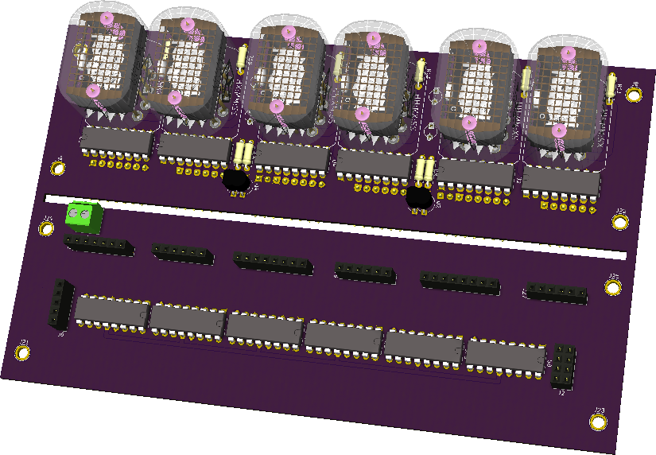
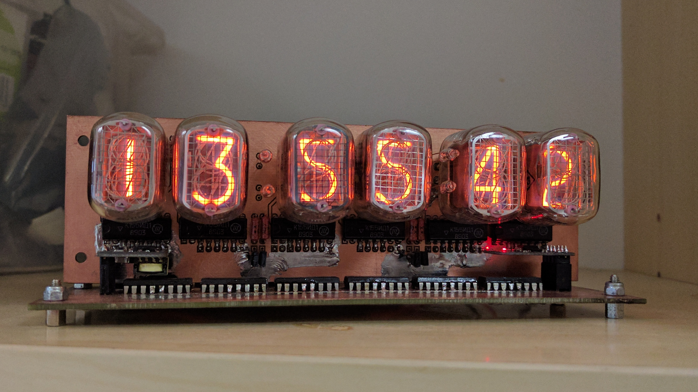

# NixiESP12

## Intro

Yet another Nixie clock project!

Some highlights:

* K155ID1 driven IN-12A or IN-12B tubes for hour, minute, seconds
* BS107 driven IN-6 or similar neon bulbs for digit separation
* 74HC595 for serial to parallel conversion
* ESP8266 for time synchronization
* LM1117-3.3V and LM1117-5V regulators for logic power supply
* No tube step up converter on-board, pin headers for connecting
  <a href="http://www.ebay.com/itm/DC-5V-12V-to-170V-DC-High-Voltage-NIXIE-Power-Supply-Module-PSU-NIXIE-TUBE-ERA-/322511957768?hash=item4b1735ef08">third party power supply</a>
* KiCad design with 3D models from http://miniwatt.info

Some KiCad screenshots:



Photos:




## Install

Boot ESP8266 with program pin held low and flash MicroPython:

```bash
esptool.py --port /dev/ttyUSB0 --baud 460800 erase_flash
esptool.py --port /dev/ttyUSB0 --baud 460800 write_flash --flash_size=detect 0 esp8266-20170612-v1.9.1.bin 
```

Upload main.py and boot.py and adjust network configuration in boot.py accordingly.

## Assembly tips

Some cheap 1117V regulators don't offer short circuit protection
and once blown pass through input voltage,
make sure you get ones with protection otherwise you can fry ESP8266
or serial-to-parallel chips.

Once the PCB is milled or etched make sure you clean the 180V rails thoroughly,
that voltage is high enough to cross gaps of 0.1mm.
Once that happens it burns a thick dark trace into the fiberglass of PCB and
it's pretty tricky to clean up.

Use the bench power supply to gradually power up the device,
at 9V set current limiter to 0.5A max.
5V linear regulator can be omitted and bypassed if 5V wall adapter is always used.
Otherwise 6V-12V wall adapters are suitable,
Thincan DBE60 9V wall adapters are pretty much perfect for the job.
Note that the higher the input voltage the more power is dissipated
as heat on the 3.3V and 5V voltage regulators, thus at 12V the device gets really hot.
